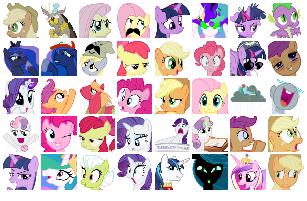
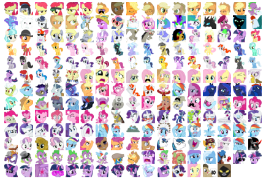

MLP Emoji
=========

r/mylittlepony
--------------

Emoji taken and organized from [r/mylittlepony][]'s [emote_guide][].

Special Thanks to @SteveStreza for pointing out [r/mylittlepony][].

r/mlplounge
-----------

Emoji taken and organized from [r/mlplounge][]'s emote tables.

Emoji For Slack
===============

 - [r-mylittlepony Slack.yml](r-mylittlepony Slack.yml)

    

 - [r-mlplounge Slack.yml](r-mlplounge Slack.yml)

    

Manual Emoji Upload
-------------------
Open your Org's customize pane and upload them by hand:

        https://<org>.slack.com/customize/emoji

3rd Party Uploader
------------------
Optionally there is a bulk uploader based in npm named [emojipacks][].

Emojipacks software relies on a newer version of nodejs than Ubuntu14 Ships.
I recommend installing it into a Container (Docker) or VM (Virtualbox),
and patching that environment as documented in [this comment][emojipacks-ubuntu]

Emojipacks relies on **plaintext credentials!!** so I recommend also
using a non-admin slack account, and change its password or delete the
account after uploading.

[r/mylittlepony]:    http://www.reddit.com/r/mylittlepony/
[r/mlplounge]:       http://www.reddit.com/r/mlplounge/
[emote_guide]:       https://www.reddit.com/r/mylittlepony/wiki/emote_guide
[emojipacks]:        https://github.com/lambtron/emojipacks
[emojipacks-ubuntu]: https://github.com/lambtron/emojipacks/issues/13#issuecomment-189972505
